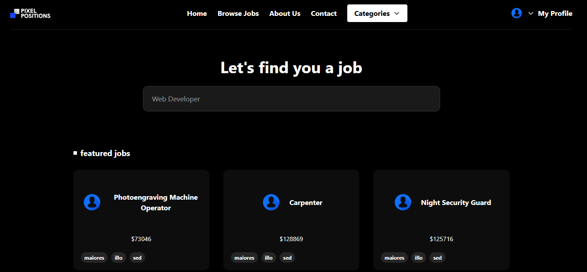

# 🎯 Pixel Positions

**Pixel Positions** is a modern job-finding website built with Laravel. It helps job seekers find relevant opportunities and companies to post job listings. The project is built with simplicity and performance in mind, using SQLite as the database.

## 🌟 Features

- ✅ Browse job listings
- ✅ Register and log in as a job seeker or employer
- ✅ Post and manage job listings
- ✅ Upload profile pictures

## 🖼️ Screenshot



## 🧰 Tech Stack

- **Framework:** Laravel 10
- **Database:** SQLite
- **Templating Engine:** Blade
- **Styling:** Tailwind CSS
- **Authentication:** Laravel Breeze

## 🚀 Getting Started

### 1. Clone the project

```bash
git clone https://github.com/yourusername/pixel-positions.git
cd pixel-positions
composer install
npm install && npm run dev
cp .env.example .env
php artisan key:generate
php artisan migrate
php artisan serve


✍️ Author: Amirhossein


I have created a user to speed things up for testing:
Email: amirhosseinbsh99@gmail.com
password:123456


